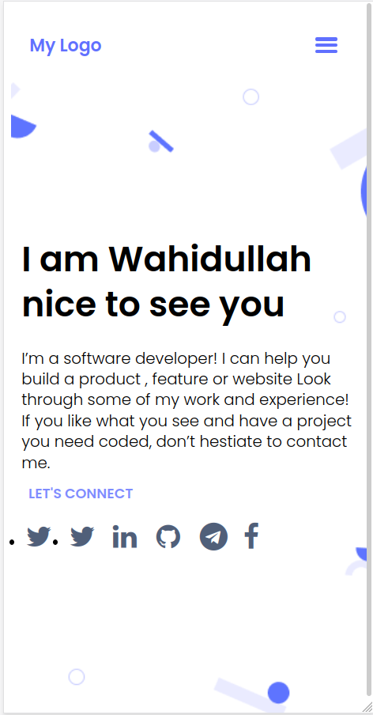

# Protofolio

> I have tried to design a mobile version of protofilio.

It is a Protofolio template mobile version and I am working on it to make a great responsive protofolio template.

## Built With

- HTML
- CSS
- 
## Getting Started

for using this template you just need to clone it then you can run index.html file and it showsup in your browser

## Authors

👤 **Wahidullah Shadab**

- GitHub: [@githubhandle](https://github.com/shadabwahidullah)
- LinkedIn: [LinkedIn](https://www.linkedin.com/in/wahidullah-shadab-2712031a3)

## 🤝 Contributing

Contributions, issues, and feature requests are welcome!

## Show your support

Give a ⭐️ if you like this project!

## Acknowledgments
I have used a ready to use figma template provided by Microvers and it's really cool. Hereby I thank them for giving permission to use this template

## 📝 License

This project is [MIT](./MIT.md) licensed.
